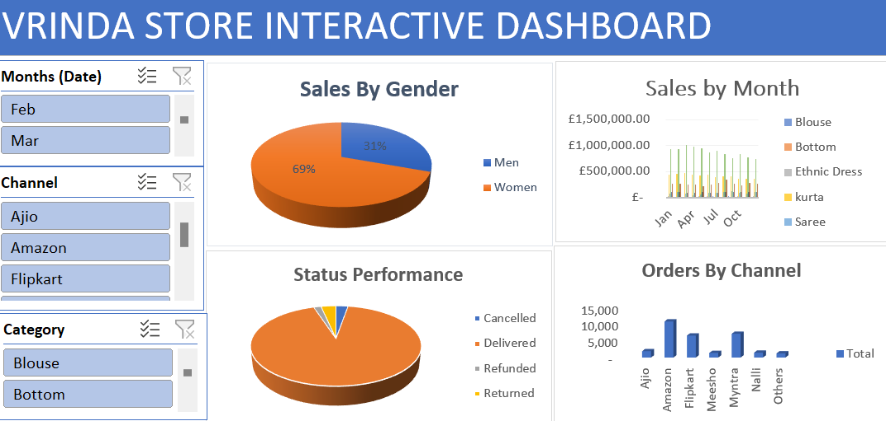
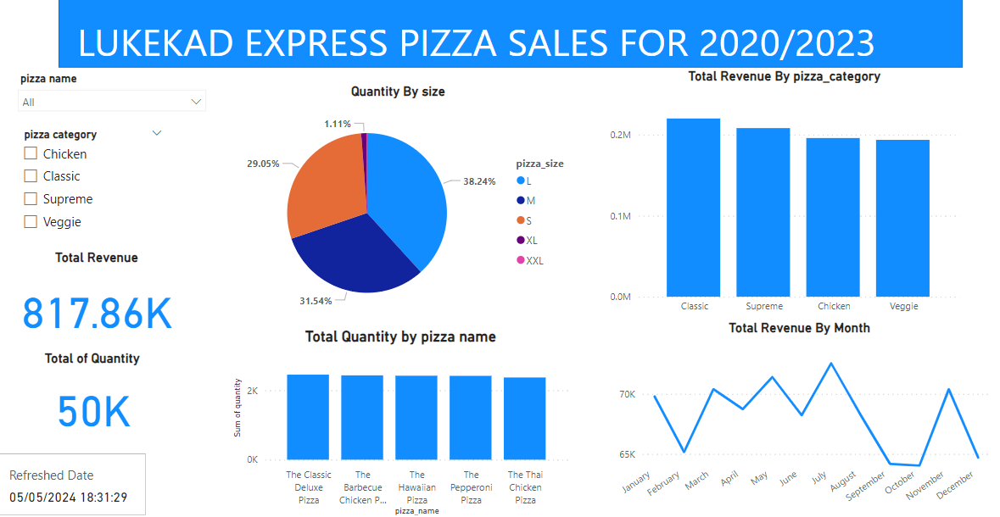

# Maxwell Ehwi Data Analytics Portfolio
# Project 1
**Title:** [Vrinda Store sales performance.](https://github.com/MAXWELLEHWI/maxwellehwi.github.io)

**Project Summary:** This excel dashboard was created to identify the trend of sales performance of each product sold by vrinda for the year 2022.The main page features a series of interactive visuals, including pie charts showing trend in sales by gender, and also a trend showing the status of performance of products distributed.There is also bar graph comparing sales by each months and another showing orders trend by channel of distribution. Users can filter the data by months,category and channel of distribution using Slicers.The dasboard is design for easy navigation, with intuitive tooltips and clickable elements to expore the data futher.Overall, it offers a clear and insightfull view of sales data, helping stakeholders make informed decisions.

**Dashboard Overview:**

# Project 2
**Title:** [Lukekad Pizza Express Sales performance for 2022.](https://github.com/MAXWELLEHWI/maxwellehwi.github.io)

**Project Summary:** The dashboard shows the sales performace of various pizza catogories sold by Lukekad pizza express for the year 2022.

**Dashboard Overview:**

